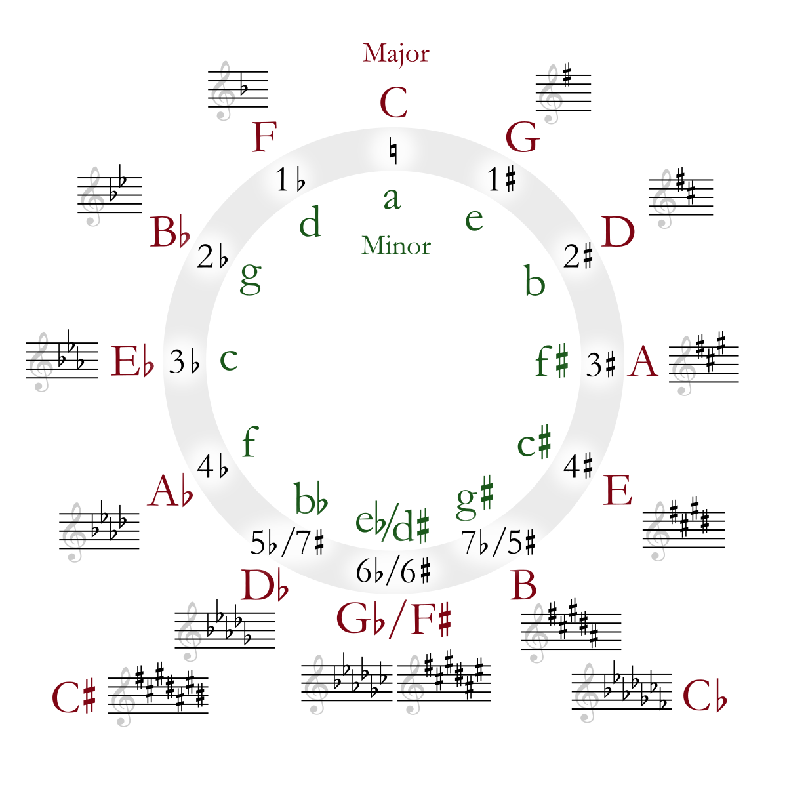

# algorithm-music-transposition

> _music is math in motion. We improvise by determining key and time signatures in real time, using music and math._

## The "key signature" / tTransposition" algorithm

This little algorithm uses "bit mapping/masking" theory to create visual representations of musical key signatures, and therefore transpose to any major or minor scale easily, _bypassing "key signatures and memorization" altogether, and instead just using linear mathematical intervals._

## Transposes any key to major (ionian) or minor (aeolian scales)

The basics of music theory and transposition are:

> Either use math and music theory:
- use the [musical interval system](https://en.wikipedia.org/wiki/Interval_(music)) to determine the intervals of the mode;
- "shift" the "starting point" for ionian mode (the "tonic" or "root" note of the mode);
- determine the new notes from those intervals.

> Or memorize the circle of fifths

- _The circle of fifths represents a circular "ring buffer" or "doubly linked list..."_
- This may also be done by **memorizing the order of sharps and flats** and iterating each time through those constructs whenever improvisation is required to find the correct key signature.

